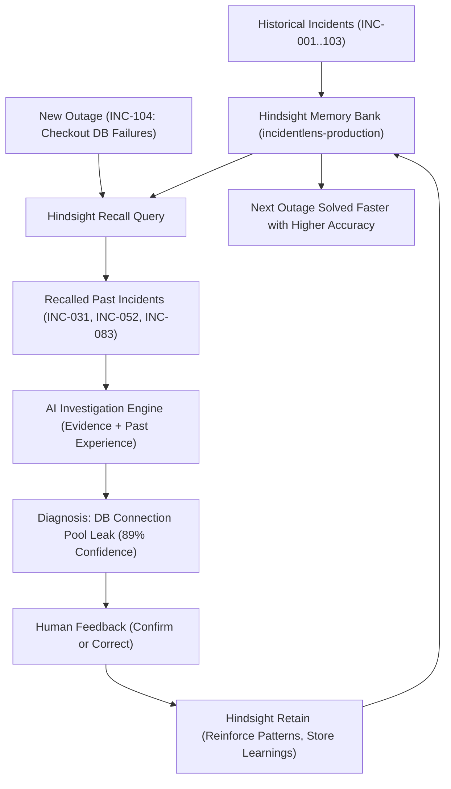

# IncidentLens

> **Don't investigate the same incident twice.**

IncidentLens is an autonomous, learning-first incident investigation platform powered by **Hindsight** persistent organizational memory. Every production outage, human confirmation, and diagnostic correction enriches the organization's memory bank, enabling the AI to recall past lessons, identify repeated failure patterns, and guide engineers to resolution in minutes.

Built for the hackathon: **AI Agents That Learn Using Hindsight**.

---

## ⚡ The Virtuous Memory Cycle



---

## 🌟 Key Capabilities

1. **Genuine Persistent Organizational Memory**: Integrated with official Hindsight SDK (`hindsight-client`) using bank `incidentlens-production`.
2. **Deterministic & Graceful Degradation**: Works seamlessly with live Hindsight Cloud credentials, and gracefully degrades to local grounded memory if unconfigured or offline—never crashing or presenting empty screens.
3. **Evidence-Grounded Investigation**: Synthesizes current telemetry (error rates, database connection spikes, latency, CPU) with recalled historical resolutions.
4. **Human-in-the-Loop Feedback**: Engineer feedback reinforces patterns (e.g. PAT-01 moves from 3 to 4 confirmations) and immediately retains new memories in Hindsight.
5. **No Duplicate Memory Bloat**: Idempotent seeding and duplicate prevention ensure that running investigations and seeders multiple times never corrupts or duplicates memory records.

---

## 📐 System Architecture

IncidentLens is structured as a modern full-stack application:

- **Frontend**: TanStack Start / Vite, React 19, Tailwind CSS v4, Lucide icons, dark-mode optimized Command Center.
- **Backend**: FastAPI (Python 3.12+), SQLAlchemy SQLite persistent store, Pydantic v2 schemas.
- **Memory Layer**: Hindsight Memory Engine (`hindsight-client`) with bank management, semantic recall, and retention mission.
- **AI Investigation Engine**: Grounded domain reasoning + optional LLM synthesis (OpenAI/Anthropic/OpenAI-compatible).

```
incident-memory-main/
├── backend/
│   ├── app/
│   │   ├── api/             # FastAPI REST endpoints
│   │   ├── database/        # SQLite engine & sessions
│   │   ├── hindsight/       # Real Hindsight client integration
│   │   ├── investigation/   # Diagnostic reasoning & LLM synthesis
│   │   ├── models/          # SQLAlchemy ORM models
│   │   ├── schemas/         # Pydantic camelCase API schemas
│   │   ├── seed/            # 10 canonical historical incidents + INC-104
│   │   ├── services/        # Business logic & stats calculation
│   │   ├── config.py        # Environment & settings
│   │   └── main.py          # FastAPI application factory
│   ├── tests/               # Pytest test suite (15 passed tests)
│   ├── .env.example         # Template configuration
│   └── requirements.txt     # Python dependencies
├── frontend/
│   ├── src/
│   │   ├── components/      # UI components & Command Center
│   │   ├── context/         # Live state synchronization
│   │   ├── routes/          # TanStack Start / React Router pages
│   │   ├── services/        # Backend API service client
│   │   └── types/           # TypeScript definitions
│   └── package.json
└── README.md
```

---

## 🚀 Quickstart Guide

### 1. Prerequisites
- **Python**: 3.10+ (tested on Python 3.12)
- **Node.js**: 20+ (tested on Node 24)

### 2. Backend Setup

```bash
# Navigate to backend
cd backend

# Create and activate virtual environment (optional but recommended)
python -m venv venv
# On Windows:
.\venv\Scripts\Activate.ps1
# On Linux/macOS:
source venv/bin/activate

# Install dependencies
pip install -r requirements.txt

# Configure environment
cp .env.example .env
# Edit .env with your HINDSIGHT_API_KEY (optional, fallback is built-in)

# Run database seeder (seeds 10 historical incidents + 1 active incident INC-104)
python -m app.seed

# Run tests to verify setup
pytest

# Start the FastAPI server
uvicorn app.main:app --reload --port 8000
```

The backend will be running at `http://localhost:8000`.
- Interactive API Docs: `http://localhost:8000/docs`
- Health check: `http://localhost:8000/api/health`

### 3. Frontend Setup

```bash
# Navigate to frontend (in a separate terminal)
cd frontend

# Install dependencies
npm install

# Start the development server
npm run dev
```

The frontend will be running at `http://localhost:3000` (or `http://localhost:5173`).

---

## 🎬 60-Second Demo Walkthrough

1. **Command Center (`/dashboard`)**:
   - Notice **1 active incident (INC-104)**, **10 historical incidents**, **4 learned patterns**, and **10 Hindsight memories**.
   - Review active incident telemetry: 18.4% error rate, 98% DB connection exhaustion.
   - Click **Investigate**.

2. **Investigation Workspace (`/investigate`)**:
   - Click **Run Investigation**.
   - Watch the investigation pipeline in action:
     - Analyzing current incident evidence...
     - Recalling relevant organizational memory from Hindsight...
     - Matching historical incidents...
   - **Hindsight Recall displays 3 previous incidents**:
     - `INC-031` (96% similarity) — Connection pool exhausted after deploy.
     - `INC-052` (89% similarity) — Leaked connections after release.
     - `INC-083` (84% similarity) — Connection leak due to missing close().
   - **Investigation Report**:
     - Diagnoses: **Database connection leak following recent deployment** (89% confidence).
     - Evidence and step-by-step recommended resolution (verify connection pool, check connection leaks, rollback deployment).

3. **Human Feedback**:
   - Click **Confirm Diagnosis**.
   - Add optional notes (e.g., *"Confirmed rollback resolved the connection pool saturation"*).
   - Click **Save to Hindsight**.

4. **Verify Hindsight Learning (`/dashboard`, `/learning`, `/memory`)**:
   - INC-104 is now marked **Resolved** and added to Hindsight memory bank.
   - Total memories increase from **10 to 11**.
   - Confirmed outcomes increase from **10 to 11**.
   - Pattern `PAT-01` (*Deployment + DB saturation → Connection leak*) is reinforced from **3 to 4 confirmations**.
   - Re-running the investigation prevents duplicate entries.

---

## 🔑 Hindsight Configuration

To use your live Hindsight Cloud account:

1. Sign up / log in to [Hindsight](https://hindsight.vectorize.io).
2. Generate an API Key.
3. In `backend/.env`:
   ```ini
   HINDSIGHT_API_KEY=your_actual_api_key_here
   HINDSIGHT_BASE_URL=https://api.hindsight.vectorize.io
   HINDSIGHT_BANK=incidentlens-production
   ```
4. Restart the backend: `uvicorn app.main:app --reload --port 8000`.
5. The sidebar badge will reflect **Hindsight Connected** (green). If running without an API key, the system runs with grounded offline memory (**Local Memory Grounded**), ensuring zero disruption during presentations.

---

## 🧪 Testing & Verification

The backend includes a comprehensive test suite covering all 17 functional requirements and persistent memory verification:

```bash
cd backend
pytest -v
```

All 15 tests pass with 100% assertions satisfied.

---

## 📜 License
MIT License. Built for the Microsoft Hackathon.
